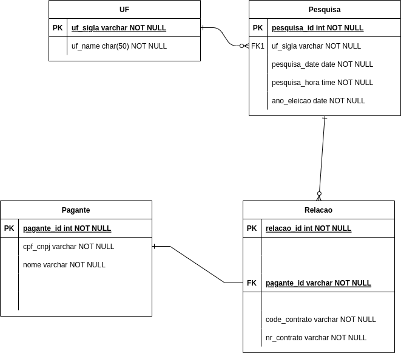

# Project Info

### Entity Diagram

(version:1.0)

## Server Info

### Launch a server

- with runserver: make runserver
- with docker: 
    - make build
    - make up

### Browsable api configuration

endpoints: 
- swagger: http://127.0.0.1:8000/swagger-ui/
- redoc: http://127.0.0.1:8000/redoc/

Reference documentation: 

- https://www.django-rest-framework.org/topics/documenting-your-api/
- https://www.django-rest-framework.org/api-guide/schemas/

## Postgres DB reference config

- https://docs.docker.com/samples/django/

## Docker containers reference

- https://www.digitalocean.com/community/tutorials/how-to-scale-and-secure-a-django-application-with-docker-nginx-and-let-s-encrypt
- https://testdriven.io/blog/dockerizing-django-with-postgres-gunicorn-and-nginx/

## Maybe need

- execute: chmod +x app/entrypoint.sh